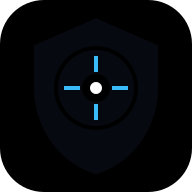

<div align="center">



# 🛡️ VIGILON

### *Your machine. Your network. Your data. One dashboard.*

[](LICENSE-MIT)
[](Cargo.toml)
[](frontend/package.json)
[](#-local-first--privacy)
[](#-contributing)

**Vigilon** is an open-source, local-first observability & security platform that shows you *everything* happening on your machine and network — hardware, processes, ports, connections — and **explains why** something looks unusual, without ever claiming certainty it can't back up.

> 🔍 It **observes and explains**. It is *not* an antivirus, EDR/XDR, or IPS — it never blocks traffic, kills processes, or phones home.

---

### ✨ What you get

| 🖥️ Hardware | 🌐 Network | 🧠 Intelligence |
|---|---|---|
| CPU, RAM, NVIDIA GPU (NVML), disks, battery, board/BIOS | Interfaces, throughput, ports→processes, connections, DNS, GeoIP flags | Heuristic rules engine, risk scoring, "Why?" explanations, timeline correlation |

🌓 Dark / Light themes &nbsp;•&nbsp; 📊 ECharts history & live topology &nbsp;•&nbsp; 📡 Multi-device fleet view &nbsp;•&nbsp; 📦 CSV/JSON export &nbsp;•&nbsp; 🚫 Blocklist + threat intel &nbsp;•&nbsp; 🔔 Windows toast alerts &nbsp;•&nbsp; 📏 Bandwidth quotas &nbsp;•&nbsp; 🔎 DNS query logging & connection inspector

</div>

---

## 🚀 Quick start

```bash
# 1 — Core: collectors + detection engine + API (http://127.0.0.1:8745)
cargo run -p vigilon-api

# 2 — Dashboard (proxies /api to the core)
cd frontend && npm install && npm run dev
```

Open 👉 **http://localhost:5173** — that's it. No accounts, no cloud, no telemetry leaving your machine.

📂 Data lives in SQLite (WAL) under `%LOCALAPPDATA%\Vigilon` (Windows) or `~/.local/share/vigilon` (Unix).
Override with `VIGILON_DATA` · bind with `VIGILON_BIND` · remotes with `VIGILON_REMOTES`.

---

## 🧩 How it works

```
                ┌─────────────────────────────┐
                │   React 19 + Tailwind +     │
                │   ECharts + React Flow      │  ← dashboard
                └──────────────┬──────────────┘
                               │ REST + WebSocket
┌──────────────────────────────▼──────────────────────────────┐
│                      Rust core (Tokio)                       │
│  collectors → normalizer → rules engine → risk score → alert │
│  Axum API  ·  SQLite (WAL)  ·  broadcast event bus           │
└──────────────────────────────┬──────────────────────────────┘
                               │ native OS APIs (no shell-outs)
                    Windows · Linux · macOS
```

**Detection philosophy — explain, don't accuse.** Every finding ships with what was observed, whether it's the first occurrence, the exact indicators behind the risk level, and a calm assessment (`INFO → LOW → MEDIUM → HIGH → CRITICAL`). The codebase even unit-tests that copy *never* says "under attack".

---

## 🗂️ Project layout

```
core/       shared types, SQLite storage, event bus, risk scoring, blocklist
platform/   OS collectors behind one trait (Windows / Linux / macOS)
agent/      sampling loop + detection engine + eval harness
api/        Axum REST + WebSocket server (the `vigilon` binary)
frontend/   React + Vite + Tailwind dashboard (12 views)
docs/       threat model, non-goals, architecture records
```

---

## 🧪 Quality gates (all green ✅)

```bash
cargo fmt --all -- --check          # formatting
cargo clippy --workspace --all-targets  # zero warnings
cargo test --workspace              # 31 tests incl. detection eval suite
cd frontend && npm test && npm run build
```

The eval harness (`agent/tests/detection_eval.rs`) replays scripted benign + malicious scenarios — browser bursts, port scans, beacons, blocklisted IPs, quota breaches, reboots — and **gates every threshold change**. It already caught and fixed a real misclassification (WAN scanners → scan rule).

---

## 🤝 Contributing — yes, you! 🌍

**Vigilon is 100% open source (MIT OR Apache-2.0) — free to use, fork, and improve.** Whether it's your first PR or your fiftieth, you're welcome here.

- 🐛 Found a bug? [Open an issue](../../issues)
- 💡 Have an idea? Start a discussion or PR
- 🛠️ Code, docs, translations, tests — all contributions count
- 📖 Please read the [threat model](docs/threat-model.md) & [non-goals](docs/non-goals.md) first — they define what Vigilon *won't* become

```bash
git clone https://github.com/MOHAMED-EL-HADDIOUI/vigilon.git
cd vigilon
cargo build --workspace
cd frontend && npm install && npm run dev
```

---

## 👨‍💻 Author

<div align="center">

### Built with passion by **Mohamed El Haddioui** 🚀

[](https://www.linkedin.com/in/mohamed-el-haddioui-ba8ba8170/)
[](https://github.com/MOHAMED-EL-HADDIOUI)
[](https://mohamedelhaddioui.netlify.app/)
[](mailto:mohamedelhaddioui99@gmail.com)

*Open to collaboration, feedback, and new ideas — don't hesitate to reach out!* 💬

</div>

---

## 📄 License

Dual-licensed **MIT OR Apache-2.0** — use it anywhere, including commercial projects. See [LICENSE-MIT](LICENSE-MIT) and [LICENSE-APACHE](LICENSE-APACHE).

<div align="center">

⭐ **If Vigilon helps you understand your machine, give it a star!** ⭐

*Your machine. Your network. Your data.* 🛡️

</div>
